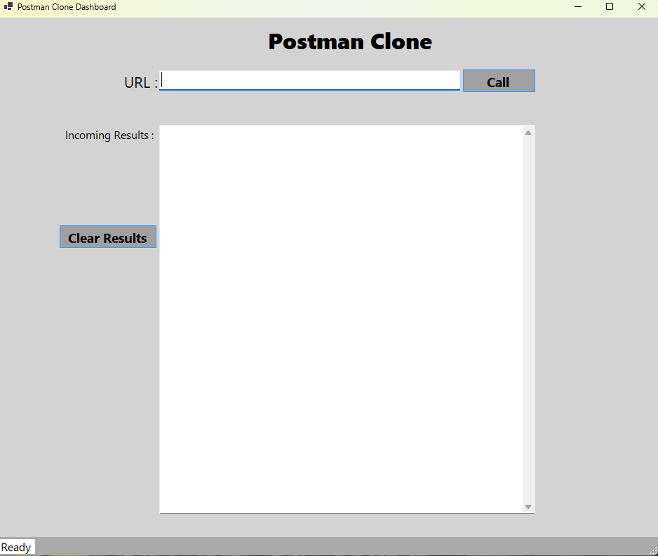
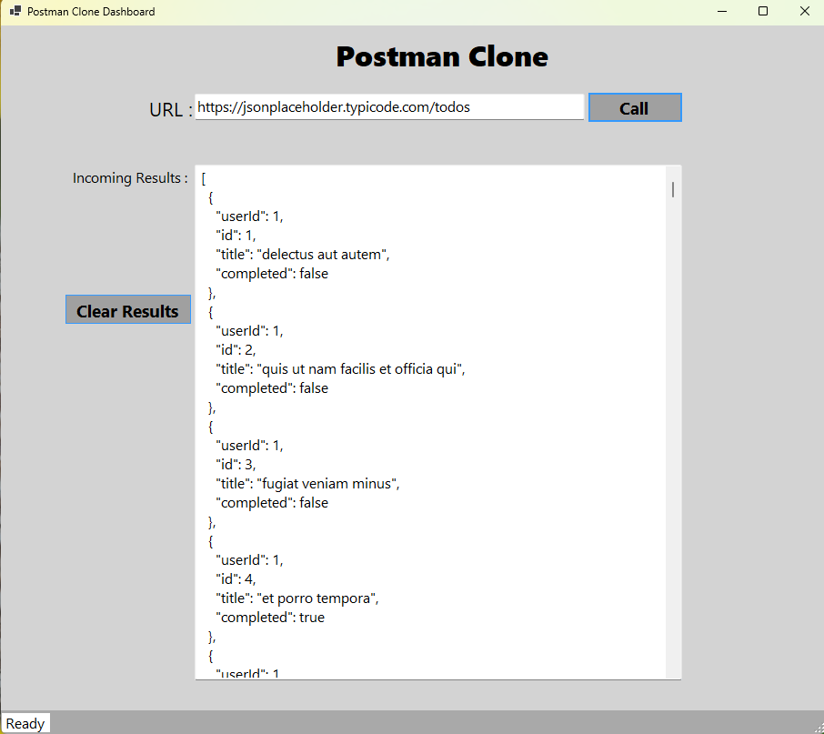

# Postman Clone App
Postman Clone provides a user-friendly interface for making GET request to APIs and viewing the responses in formatted JSON. Ideal for developers and testers, this tool simplifies API interaction and debugging, helping you efficiently validate and  troubleshoot your API calls.

## Technologies Used
* C#
* .NET 8
* WinForms
* HttpClient

## Using the Application
1. Download the executable file from the release section.
2. When the application launches, it should look like this:
   

3. Fill in the API URL and hit the "Call" button.
4. Results will look similar to this:

## Potentially Upcoming Changes 
* Adding the POST, PUT, PATCH and DELETE functionality.
* Adding API headers.
* Handling API authentification.
* Adding Dependancy Injection.
* Adding Logging.
* Create a web-based user interface for the application.

